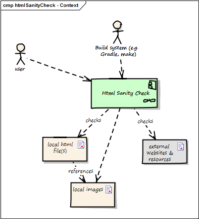
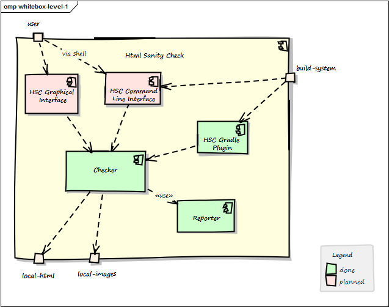

= HTML Sanity Checker Architecture Documentation
:author: Gernot Starke
:email: gernot.starke@innoq.com
:date: May 30th 2014
:revision: Version 0.9b

:toc:

(C)
We acknowledge that this document uses material from the arc 42 architecture
template, http://www.arc42.de.
Created by Dr. Peter Hruschka & Dr. Gernot Starke.
Asciidoc version by Jürgen Krey.

This material is open source and provided under the Creative Commons Sharealike 4.0 license.
It comes *without any guarantee*. Use on your own risk.

== Introduction and Goals

[NOTE]
====
Within the following text, the "Html Sanity Checker" shall be abbreviated with +HtmlSC+
====

=== Requirements Overview

+HtmlSC+ shall provide the following functionality:

. +HtmlSC+ shall read a single (configurable) html file and perform the following checks:
.. Check all image tags wether the referenced image files exist
.. Check all internal links from anchor-tags (href="XYZ") wether the link targets "XYZ"
are defined
.. Check all bookmark definitions (... id="XYZ") wether the id's ("XYZ") are unique.

. +HtmlSC+ can be configured to either
.. output on stdout (the console)
.. creates an html/markdown (or similar) output within a configurable directory

. +HtmlSC+ can be called from the command line with arguments and options
. +HtmlSC+ can be integrated in a gradle-build as plugin

=== Quality Goals

[format="csv", options="header", cols="1,2,6"]
.Quality-Goals
|===
Priority,Quality-Goal,Scenario
1, Correctness, Every broken internal link is found
2, Performance, Check of 100kB html file performed under 10 secs (excluding gradle startup)
|===

=== Stakeholder

[options="header", cols="2,4,5"]
.Stakeholder
|===
| Role | Description | Goal, Intention

| [[arc42_user]] arc42 user | uses the arc42 template for architecture documentation
| wants a small but practical example of _how to apply arc42_.

| aim42 contributor
| contributes to aim42 methode-guide
| check generated html code to ensure links and images are correct during
(gradle-based) build process

| arc42 user
| uses the arc42 template for architecture documentation
| wants an example of pragmatic arc42 usage

|===

== Constraints

* Shall be platform independend and should run on the major operating systems
(Windows (TM), Linux and Mac-OS(TM))
* Shall be integrated with the Gradle build tool
* Liberal open-source license

== Context

// tabular description of context view
[options="header", cols="1,4"]
.Context
|===
| Neighbour | Description
| user | documents software with toolchain that generates html. Wants to ensure that
links within this html are valid.
| build system |
| local html files | +HtmlSC+ reads and parses local html files and
performs sanity checks within those.
| local image files | +HtmlSC+ checks if linked images exist as (local) files.
| external web resources | Optionally +HtmlSC+ can be configured to check for the existance
of external web resources. Due the nature of web systems, this check might need a significant
amount of time and might yield invalid results due to network and latency issues.
|===

== Building Block View

=== Whitebox +HtmlSC+ (Level 1)

Rationale::
_reasons for this structure_

Contained Blackboxes::

[cols="1,2" options=""]
|===
| <<checker_blackbox, Checker>> | core: html parsing and sanity checking, file handling
| HSC Gradle Plugin | integrates the Gradle build tool with +HtmlSC+,
enabling arbitrary gradle builds to use +HtmlSC+ functionality.
| HSC Command Line Interface | (not documented)
| HSC Graphical Interface | (planned, not implemented)

| Reporter
| outputs the collected checking results to configurable
destinations, e.g. StdOut or a html file.
|===

Interfaces::

[cols="1,4", options="header"]
|===
| Interface | Description
| usage via shell | <<arc42_user, arc42 user>> uses a command
line shell to call the +HtmlSC+
| build system  | currently restricted to Gradle: The build
system uses +HtmlSC+ as configured in the buildscript.
| local-html and local-images | +HtmlSC+ needs access to several
local files, especially the html page to be checked and to the
corresponding image directories.
|===

[[checker_blackbox]]
==== _Checker_ (Blackbox)

Intent/Responsibility:: Checker contains the core functions
to perform the various sanity checks. It parses the html file
into an DOM-like in-memory representation, which is then
used to perform the actual checks.

Interfaces::
[cols="2,4", options="header"]
|===
| Interface (From-To) | Description

| Command Line Interface -> Checker
| Exposes the #AllChecksRunner class, as described
in <<allChecksRunner, AllChecksRunner>>.

| Gradle Plugin -> Checker
| Exposes +HtmlSC+ via a standard Gradle plugin,
as described in the Gradle user guide.
|===

Files::
    +org.aim42.htmlsc.AllChecksRunner+,
    +org.aim42.htmlsc.HtmlSanityCheckGradlePlugin+

== Runtime View
Note: Not appropriate for this system due to very simple implementation.

== Deployment View
Sanity checker will:

1. be bundled as a single jar.
2. be uploaded to a public repository (MavenCentral, JCenter, Bintray or similar),
referencable within a gradle buildfile.
3. provide a +main+ method with parameters and options, so all checks can be
called from the command line.

== Technical and Crosscutting Concepts
to be done.

== Design Decisions

=== Decision: Checking of external links postponed
